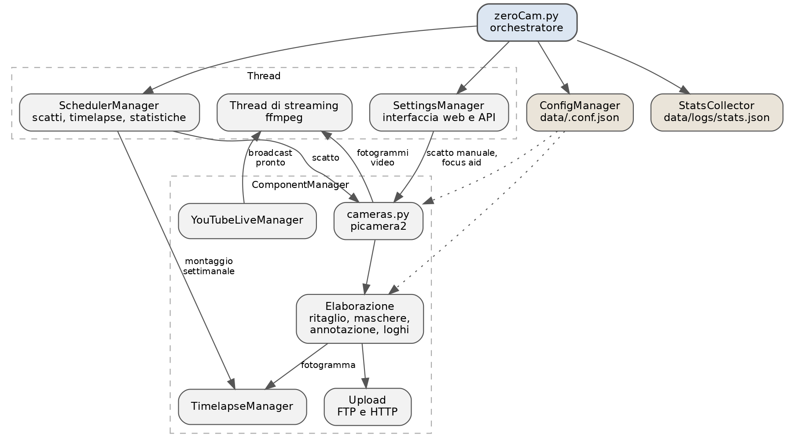

# Introduzione

## Che cos'è zeroCAM

zeroCAM trasforma un Raspberry Pi 5 con una PiCamera HQ in una webcam paesaggistica completa: scatta a intervalli regolari, elabora l'immagine, la pubblica dove serve e — se richiesto — trasmette in diretta su YouTube e monta un timelapse settimanale.

A differenza di una webcam da scaffale, l'esposizione non è lasciata all'automatismo del sensore: nelle ore di luce scarsa il software cerca la posa migliore con un bracketing su tempo e guadagno, così alba, tramonto e notte restano leggibili invece di diventare macchie nere o bruciate.

Tutto si governa da un'interfaccia web sul dispositivo, senza toccare file di configurazione a mano.

## Funzioni principali

* **Scatti automatici** a intervallo configurabile, con parametri diversi per alba, giorno, tramonto e notte.
* **Esposizione automatica di giorno, bracketing manuale** su tempo di posa e guadagno nelle altre fasi, con memoria dell'ultima posa riuscita.
* **Elaborazione dell'immagine**: ritaglio, maschere privacy (sfocate o coperte), barra di annotazione con testo e data/ora, loghi sovrapposti, maschera di contrasto opzionale.
* **Pubblicazione**: upload FTP, upload HTTP verso un endpoint con token, ultima immagine sempre disponibile via web.
* **Diretta YouTube**: push RTMP con creazione e collegamento automatico del broadcast via API, ritrasmissione simultanea verso altre destinazioni RTMP, annotazione e loghi anche sul video.
* **Timelapse settimanale**: raccolta dei fotogrammi, montaggio con ffmpeg e caricamento su YouTube, con galleria di anteprima nell'interfaccia.
* **Integrazione ONVIF**: istantanea e profilo media per NVR e software di videosorveglianza.
* **Gestione**: log a schermo, statistiche hardware storiche, backup e ripristino cifrato della configurazione, riavvio da interfaccia, aiuto alla messa a fuoco.

## Requisiti

**Hardware**

La configurazione supportata è una sola, ed è quella per cui il software è pensato e provato:

* **Raspberry Pi 5**;
* **Raspberry Pi Camera Module HQ** (sensore IMX477) con obiettivo a innesto C/CS.

Non sono supportati modelli di Pi precedenti né altre camere. Non è una limitazione arbitraria: la codifica dello streaming e il montaggio del timelapse chiedono la potenza del Pi 5, e il bracketing di esposizione notturno è tarato sul sensore della HQ. Su hardware più modesto il risultato è una webcam che scatta in ritardo, perde fotogrammi in diretta e produce notti inguardabili — cioè esattamente ciò che zeroCAM esiste per evitare.

Serve inoltre:

* alimentatore ufficiale da 27 W (il Pi 5 sotto carico non perdona alimentazioni scarse);
* microSD di buona qualità o, meglio, un SSD su USB 3: con la raccolta dei fotogrammi attiva la scrittura è continua;
* connessione di rete stabile, obbligatoria per upload, diretta e timelapse.

**Software**

* Raspberry Pi OS a 64 bit basato su Debian Bookworm o successivo.
* Lo script di installazione porta con sé tutto il resto: `python3-picamera2`, `ffmpeg`, `libcamera`, ambiente virtuale Python e dipendenze.

Bookworm è un requisito, non una raccomandazione. Le versioni precedenti configurano la rete con `dhcpcd` e `wpa_supplicant`, mentre da Bookworm il compito è di **NetworkManager**: la pagina *Network* parla con quest'ultimo e su un sistema più vecchio non ha nessuno con cui parlare. Anche il resto — `picamera2`, le versioni di `libcamera`, `ffmpeg` — è provato lì e soltanto lì. Su Bullseye o precedenti zeroCAM non è supportato, e non lo sarà.

## Come è fatto

L'applicazione è un unico processo Python (`zeroCam.py`) che avvia alcuni thread:

| Componente | Ruolo |
|---|---|
| `SchedulerManager` | Pianifica scatti, diagnostica, raccolta statistiche, timelapse e pulizia |
| `ComponentManager` | Costruisce e tiene insieme camera, uploader, annotatore, maschere, timelapse, YouTube |
| `SettingsManager` | Interfaccia web e API REST (Flask servito da waitress in HTTP, da cheroot in HTTPS) |
| `StatsCollector` | Legge temperatura, CPU, memoria e disco e ne conserva lo storico |
| `cameras.py` | Cattura, streaming e gestione del sensore tramite `picamera2` |

{ width=95% }

Il ciclo di lavoro è sempre lo stesso: lo streaming, se attivo, viene interrotto per il tempo dello scatto, la foto viene elaborata e pubblicata, poi lo streaming riparte. È il motivo per cui alcune impostazioni della diretta hanno effetto solo dal ciclo successivo.

## Come leggere questo manuale

I capitoli seguono l'ordine naturale di lavoro: installazione, primo accesso, rete, configurazione, poi una parte per ciascuna funzione (scatto, privacy, annotazione, pubblicazione, diretta, timelapse) e infine l'integrazione ONVIF, la manutenzione e la risoluzione dei problemi.

Il capitolo *Riferimento della configurazione* raccoglie tutte le chiavi del file `.conf.json` con il loro significato, utile quando si sa già cosa cercare.

Le voci dell'interfaccia sono citate come **Configuration → Stream**, i percorsi su disco come `/usr/local/zerocam/data`, i comandi da terminale in blocchi di codice.
