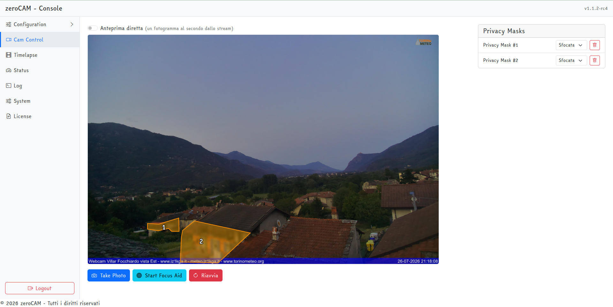

# L'interfaccia web

## Accesso

L'interfaccia risponde sulla porta 8080 del dispositivo:

```
http://<indirizzo-del-raspberry>:8080/
```

Utente `admin`, password quella scelta durante l'installazione. La sessione resta aperta finché non si esce con **Logout** o non scade.

L'interfaccia non carica nulla da Internet: Bootstrap, Vue, Chart.js e il resto sono distribuiti dentro l'applicazione. Se la connessione della webcam cade — che è poi il momento in cui la si vuole aprire — la console continua a funzionare per intero, grafici compresi.

### La pagina pubblica

La console è amministrazione: da lì si cambia la configurazione, si leggono i log e si riavvia il dispositivo. Per far vedere la webcam a qualcuno non serve tutto questo, e non conviene darne l'indirizzo.

In **System → Pagina pubblica** si attiva una vetrina in sola lettura. Attivandola i due indirizzi si scambiano di posto:

| Indirizzo | Con la vetrina accesa | Con la vetrina spenta |
|---|---|---|
| `/` | La vetrina, senza autenticazione | La console, che chiede di accedere |
| `/zc-admin` | La console | La console |
| `/public` | La vetrina | `404` |

Chi arriva sull'indirizzo nudo vede quindi il panorama, non il pannello di amministrazione; alla console si arriva dal lucchetto in alto a destra nella vetrina, o direttamente da `/zc-admin`.

La vetrina mostra l'ultimo scatto, l'ora in cui è stato preso e, se lo si indica, un collegamento alla diretta. Si aggiorna da sola con una cadenza legata all'intervallo di scatto. Non chiede autenticazione — è il suo scopo — e per questo non espone nient'altro: non legge la configurazione, non mostra il log e non accetta comandi. Titolo e link si impostano nella stessa pagina; lasciando vuoto il titolo compare il nome del dispositivo.

È l'indirizzo da esporre o da mandare in giro al posto della console. Finché è spenta, quelle rotte rispondono `404` come se non esistessero.

### Connessione cifrata

Di default l'interfaccia risponde **in chiaro**: chiunque sia in grado di osservare la rete fra il browser e la webcam legge la password e il contenuto della sessione. Su una rete domestica il rischio è modesto; esporre la porta su Internet così com'è significa consegnare le credenziali a chiunque stia in mezzo.

In **System → Accesso all'interfaccia** si attiva l'HTTPS, che risponde su una porta separata (8443 di default):

```
https://<indirizzo-del-raspberry>:8443/
```

Il certificato se lo firma il dispositivo: nessuno lo attesta, quindi il browser mostra un avviso alla prima visita e va accettato una volta. Da lì in poi il traffico è cifrato — è la differenza fra *nessuno può leggere* e *chiunque può leggere*, non fra sicuro e insicuro. Il certificato viene creato al primo avvio con l'HTTPS attivo e copre `localhost`, il nome del dispositivo e i suoi indirizzi IP; se raggiungi la webcam con un altro nome, per esempio uno pubblico, va aggiunto nel campo apposito, altrimenti il browser segnalerà anche il nome sbagliato. All'avvio il log riporta l'impronta SHA-256, da confrontare con quella che mostra il browser per essere certi di parlare con il dispositivo giusto e non con qualcuno che si è messo in mezzo.

Sbagliare protocollo non costa nulla: aprendo `http://<indirizzo>:8443/` si viene rimandati allo stesso indirizzo in `https://`, invece di ricevere la connessione azzerata che darebbe un server TLS a cui si parla in chiaro. Vale per i browser: i client ONVIF e gli script che scaricano l'istantanea non seguono i redirect e non accettano un certificato autofirmato, quindi per loro va lasciata raggiungibile la porta HTTP.

Spegnendo l'HTTP resta solo l'HTTPS, ma **ONVIF smette di funzionare**: quel protocollo parla solo in chiaro.

Resta vero che il modo più solido per raggiungere la webcam da fuori casa è una VPN — nell'installazione è presente `wireguard` — o un reverse proxy con un certificato riconosciuto. L'HTTPS autofirmato è il rimedio immediato, non quello definitivo.

## Le pagine

In alto compaiono il marchio e la parola *Console*, con la versione in esecuzione all'estremità destra: è il primo posto da guardare per sapere quale versione sta girando davvero.

{ width=100% }

**Configuration** apre un sottomenu con tutte le sezioni della configurazione: Device Details, ONVIF, FTP Upload, HTTP Upload, Camera, Stream, Overlays, Annotation, Timelapse, Network, Assets. In fondo alla pagina c'è il pulsante **Salva Configurazione**, che vale per tutte le sottopagine: le modifiche non salvate si perdono cambiando pagina.

**Cam Control** mostra l'ultima immagine scattata e permette di disegnarci sopra le maschere privacy. Da qui si scatta a comando (*Take Photo*), si avvia l'aiuto alla messa a fuoco (*Start Focus Aid*) e si riavvia il dispositivo (*Riavvia*). Quando lo streaming è in corso compare l'interruttore **Anteprima diretta**, che sostituisce l'ultimo scatto con un fotogramma al secondo preso dal video.

**Timelapse** raccoglie la galleria dei fotogrammi, lo stato (quanti sono, quanto occupano, esito dell'ultimo montaggio) e i pulsanti per montare subito il video, con o senza pubblicazione.

**Status** mostra temperatura e carico della CPU con indicatori e grafici storici.

**Log** mostra il file di log dell'applicazione, aggiornato ogni due secondi.

**Network** mostra le interfacce di rete con i loro indirizzi, permette di passarle all'indirizzo fisso o al DHCP e di collegare il wifi. Ha un capitolo suo, *La rete*.

**System** contiene il cambio password, le porte e il certificato dell'interfaccia, l'interruttore della pagina pubblica e il backup/ripristino della configurazione.

**License** riporta i termini di licenza.

## Quando le modifiche hanno effetto

Non tutte le impostazioni entrano in vigore nello stesso momento:

| Impostazione | Quando ha effetto |
|---|---|
| Parametri della camera, ritaglio, annotazione, loghi | Allo scatto successivo |
| Destinazioni FTP e HTTP, posizione e scarti delle fasi | Allo scatto successivo |
| Maschere privacy sulla foto | Allo scatto successivo (rilette a ogni scatto) |
| Intervallo di scatto, pianificazione del timelapse | Subito: la pianificazione viene ricostruita |
| Credenziali YouTube, impostazioni della diretta e del timelapse | Subito |
| Maschere privacy sullo streaming | Al riavvio dello streaming, cioè dopo lo scatto successivo |
| Parametri dello streaming, overlay del video, destinazioni, audio | Al riavvio dello streaming |
| ONVIF abilitato o meno, porta del server web, tipo di camera | Al riavvio dell'applicazione |

Il salvataggio passa la configurazione ai componenti già in funzione, quindi quasi tutto vale dallo scatto successivo senza riavviare. Cambiando l'intervallo di scatto la pianificazione riparte da quel momento: il primo scatto arriva dopo un intervallo intero.

Il riavvio dell'applicazione si ottiene dal pulsante **Riavvia** in Cam Control (che riavvia l'intero Raspberry Pi) oppure, più rapidamente, da terminale con `sudo systemctl restart zerocam.service`.

## Sotto l'interfaccia: le API

L'interfaccia è una pagina Vue che parla con alcune rotte HTTP. Tutte richiedono la sessione autenticata, tranne le tre della pagina pubblica. Le principali:

| Rotta | Metodo | Uso |
|---|---|---|
| `/api/config` | GET, POST | Legge e salva la configurazione |
| `/api/schema` | GET | Tipi dei campi per l'interfaccia |
| `/api/config/backup` | POST | Scarica il backup cifrato |
| `/api/config/restore` | POST | Ripristina un backup |
| `/api/take_photo` | POST | Scatto immediato |
| `/api/status/capture` | GET | Indica se è in corso uno scatto |
| `/api/status/stream` | GET | Indica se la diretta è attiva con fotogrammi freschi |
| `/api/stats` | GET | Statistiche hardware, ultime e storiche |
| `/api/timelapse` | GET | Stato del timelapse |
| `/api/timelapse/run` | POST | Montaggio immediato |
| `/api/privacy_mask`, `/api/save_privacy_mask` | GET, POST | Maschere privacy |
| `/api/assets` | GET, POST | Elenca e carica audio e loghi |
| `/api/assets/<categoria>/<nome>` | DELETE | Elimina un asset |
| `/api/network` | GET | Interfacce, indirizzi e connettività |
| `/api/network/scan` | GET | Reti wifi in portata |
| `/api/network/wifi`, `/api/network/forget` | POST | Collega o dimentica una rete wifi |
| `/api/network/address` | POST | Indirizzo automatico o fisso di un'interfaccia |
| `/latest.jpg`, `/stream_latest.jpg` | GET | Ultimo scatto, ultimo fotogramma della diretta |
| `/`, `/public`, `/public/latest.jpg`, `/public/info` | GET | Vetrina pubblica: **senza autenticazione**, e solo se abilitata |
| `/zc-admin` | GET | La console: sempre autenticata |

Sono utili per automazioni proprie, ma non costituiscono un'API pubblica stabile: possono cambiare fra le versioni.
