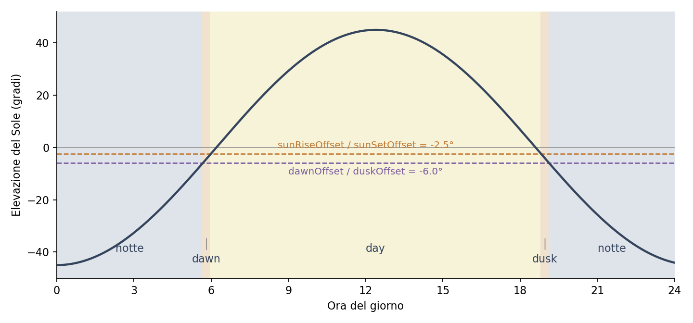

# Configurazione di base

## Device Details

**Configuration → Device Details** raccoglie l'identità e la posizione del dispositivo.

| Campo | Significato |
|---|---|
| Name | Nome della webcam, usato nella diagnostica |
| Latitude, Longitude | Coordinate decimali del punto di ripresa |
| Elevation | Quota in metri sul livello del mare |
| Sunrise/Sunset/Dawn/Dusk Offset | Soglie di elevazione solare, in gradi (vedi sotto) |
| Image H-Flip, V-Flip | Ribaltamento orizzontale e verticale dell'immagine |

Posizione e quota non servono a scrivere coordinate sull'immagine: servono a calcolare, con `ephem`, gli istanti di alba, tramonto e crepuscoli per il giorno corrente. Vanno indicate con la precisione di qualche centinaio di metri; sbagliarle sposta gli orari di passaggio fra le fasi.

I ribaltamenti servono quando la camera è montata capovolta o dietro uno specchio. Valgono sia per la foto sia per lo streaming.

## Le quattro fasi del giorno

zeroCAM non usa orari fissi: divide la giornata in quattro fasi in base all'altezza del Sole, e per ciascuna usa parametri di camera e di streaming distinti.

| Fase | Intervallo |
|---|---|
| `dawn` | Da *Dawn Offset* fino a *Sunrise Offset* |
| `day` | Da *Sunrise Offset* fino a *Sunset Offset* |
| `dusk` | Da *Sunset Offset* fino a *Dusk Offset* |
| `night` | Dopo *Dusk Offset* e fino a *Dawn Offset* |

{ width=100% }

I quattro offset sono **angoli di elevazione del Sole rispetto all'orizzonte, in gradi**, non minuti di anticipo o ritardo. Con i valori predefiniti:

* `sunRiseOffset` e `sunSetOffset` a `-2.5` — il "giorno" comincia quando il Sole è ancora 2,5° sotto l'orizzonte e finisce altrettanto dopo il tramonto geometrico, coprendo la luce ancora buona del primo mattino e della sera.
* `dawnOffset` e `duskOffset` a `-6` — corrisponde al crepuscolo civile: sotto quella soglia si entra in fase notturna.

Per anticipare il passaggio a una fase si usa un valore più negativo (il Sole è più basso, quindi accade prima al tramonto e più tardi all'alba); per posticiparlo, un valore più vicino a zero o positivo. Su una webcam affacciata su un versante in ombra conviene abbassare le soglie del giorno, per esempio a `-1`, così l'esposizione automatica non viene usata quando la valle è già in ombra.

La fase corrente viene scritta nel log a ogni scatto.

## Sicurezza e accesso

**System → Cambio Password** cambia la password dell'interfaccia; serve quella attuale. La password è conservata come hash in `.conf.json`, insieme a una chiave di sessione Flask generata al primo avvio.

Se la password viene persa, si può reimpostarla da terminale sul dispositivo:

```bash
cd /usr/local/zerocam
HASH=$(venv/bin/python -c "from werkzeug.security import generate_password_hash; print(generate_password_hash('nuova-password'))")
jq ".security.password = \"$HASH\"" data/.conf.json > /tmp/c.json && mv /tmp/c.json data/.conf.json
sudo systemctl restart zerocam.service
```

## Il file di configurazione

Tutto ciò che si imposta dall'interfaccia finisce in `/usr/local/zerocam/data/.conf.json`. I campi sensibili — password FTP e ONVIF, chiave di streaming, credenziali YouTube, token HTTP — sono cifrati e appaiono con il prefisso `enc:`. La cifratura deriva da `ZEROCAM_SECRET_KEY`, quindi il file da solo, copiato su un'altra macchina, non è leggibile: per spostare una configurazione si usa il backup della pagina System.

Il file si può modificare a mano a servizio fermo, ma non è la via consigliata: l'interfaccia conosce i tipi dei campi e riscrive i valori cifrati correttamente. Le chiavi introdotte da una nuova versione vengono aggiunte automaticamente con i loro valori di default, sia dall'installer sia al primo avvio.
