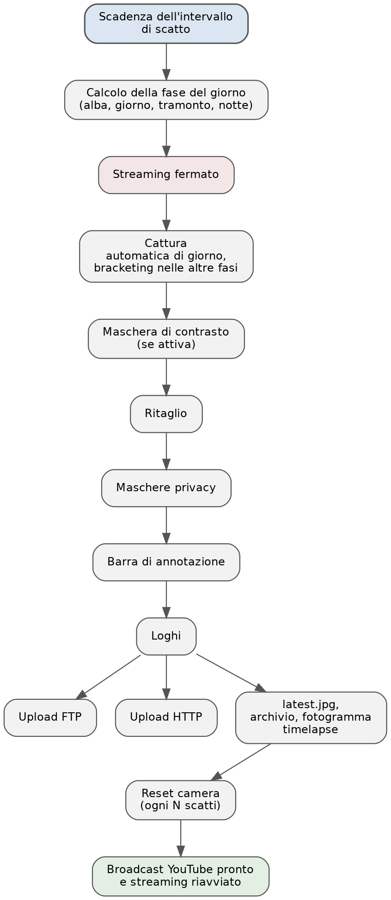
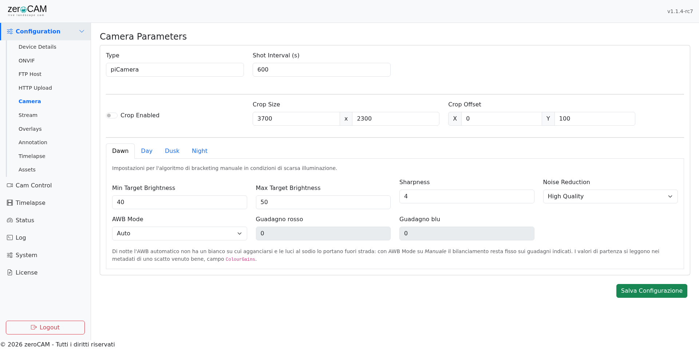

# La cattura delle immagini

## Il ciclo di scatto

Ogni `shotInterval` secondi lo scheduler avvia un ciclo che, nell'ordine:

1. rilegge la configurazione da disco;
2. calcola la fase del giorno;
3. ferma lo streaming, se attivo;
4. cattura l'immagine con i parametri della fase;
5. applica maschera di contrasto (se attiva), ritaglio, maschere privacy, annotazione e loghi;
6. carica l'immagine su FTP e su HTTP, se configurati;
7. salva `latest.jpg`, l'eventuale copia d'archivio e il fotogramma per il timelapse;
8. esegue l'eventuale reset hardware della camera;
9. prepara il broadcast YouTube e fa ripartire lo streaming.

{ width=52% }

Durante il ciclo l'interfaccia mostra lo stato: `Capturing Image`, `Annotating and Overlaying`, `Uploading Image`, `Idle`.

Uno scatto può essere avviato a mano da **Cam Control → Take Photo**: il ciclo è lo stesso.

## Parametri della camera

**Configuration → Camera** ha una scheda per ciascuna fase del giorno, più le impostazioni generali e il ritaglio.

{ width=100% }

| Impostazione in pagina | Significato |
|---|---|
| Type | Tipo di camera: `piCamera` in esercizio, `fakeCamera` per prove senza hardware |
| Shot Interval | Secondi fra uno scatto e il successivo |
| Crop Enabled, Crop Size, Crop Offset | Ritaglio dell'immagine (vedi più avanti) |

Il ciclo di scatto prevede anche il reset periodico della camera, l'archiviazione locale degli scatti e una maschera di contrasto: sono strumenti di diagnosi, senza campo nell'interfaccia e disattivati in esercizio. Le relative chiavi sono descritte nel capitolo *Riferimento della configurazione*.

### Giorno

Nella fase `day` la camera lavora in automatico: esposizione e bilanciamento del bianco sono gestiti da libcamera. I parametri configurabili sono modalità di bilanciamento (`AwbMode`), misurazione (`AeMeteringMode`), HDR (`HdrMode`), riduzione del rumore e nitidezza. Dopo l'avvio del sensore il software attende due secondi perché l'automatismo si stabilizzi, poi scatta.

### Alba, tramonto e notte

Nelle altre fasi l'automatismo non basta: viene disattivato e il software cerca la posa da sé, valutando la luminosità media dello scatto.

* **Tempi di posa** provati, in secondi: 1/8, 1/4, 1/2, 3/4, 1, 2, 4, 6, 8, 10, 12, 15, 20, 30, 45.
* **Guadagni analogici**: 1×, 2×, 4×, 8×.
* **Obiettivo**: luminosità media compresa fra *Min Target Brightness* e *Max Target Brightness* (scala 0–255; i valori tipici sono 40 e 55).

La ricerca privilegia il tempo di posa: se l'immagine è troppo scura allunga la posa e alza il guadagno solo quando il tempo è al massimo; se è troppo chiara abbassa prima il guadagno. Riconosce le oscillazioni — se torna su una combinazione già provata si ferma e sceglie la migliore — e si arrende dopo 40 tentativi, tenendo lo scatto più vicino all'obiettivo.

Gli indici dell'ultima posa riuscita vengono salvati in `data/.capture_info`: il ciclo successivo riparte da lì invece che da capo, il che rende la ricerca molto più breve nelle notti stabili.

> **Conseguenza pratica** — uno scatto notturno può richiedere minuti: ogni tentativo comporta due secondi di riscaldamento del sensore più il tempo di posa. Con un intervallo di scatto molto breve la notte può capitare che un ciclo non sia ancora finito quando parte il successivo. Un intervallo di 5–10 minuti è un buon compromesso.

## Ritaglio

**Configuration → Camera → Crop** ritaglia un rettangolo dell'immagine: si indicano larghezza e altezza in pixel e, se serve, uno spostamento rispetto al centro. Il ritaglio è centrato sull'immagine e traslato dagli offset, e viene applicato prima di maschere e annotazioni: tutte le coordinate successive (privacy mask, loghi) si riferiscono all'immagine già ritagliata.

Serve a togliere un bordo indesiderato — una grondaia, un palo — senza spostare la camera, e a portare l'immagine al formato voluto.

## Aiuto alla messa a fuoco

**Cam Control → Start Focus Aid** mette in pausa il ciclo di scatto, ferma lo streaming e mostra un flusso video continuo con due linee di riferimento incrociate al centro dell'immagine. Serve a regolare la ghiera dell'obiettivo guardando il risultato in tempo reale.

Alla chiusura (*Stop Focus Aid*) il ciclo riprende e lo streaming, se era attivo, riparte. Va usato per il tempo necessario: mentre è aperto non si scatta e non si trasmette.
