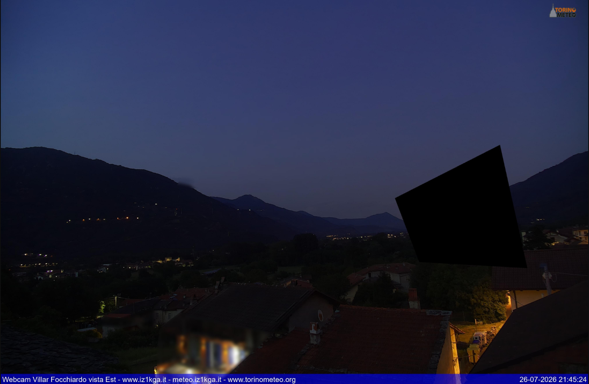

# Maschere privacy

## A cosa servono

Una webcam che inquadra un abitato riprende anche finestre, giardini e cortili che non è opportuno mostrare. Le maschere privacy coprono zone dell'immagine di forma qualsiasi, in due modi:

* **Blurred** — la zona viene resa illeggibile ma resta riconoscibile come parte del paesaggio;
* **Filled** — la zona diventa un'area nera piena.

Le maschere sono applicate sia alla foto pubblicata sia al video in diretta, e sono applicate *prima* di annotazione e loghi, che quindi non finiscono mai sotto la sfocatura.

## Come si disegnano

In **Cam Control**, sull'ultima immagine:

1. si fa clic su ogni vertice del poligono da coprire;
2. si chiude la figura con un doppio clic;
3. nella colonna di destra la maschera compare nell'elenco, dove si sceglie *Blurred* o *Filled* e la si può eliminare.

{ width=100% }

Servono almeno tre punti. Le maschere vengono salvate subito in `data/.privacy_mask.json` come coordinate relative alle dimensioni dell'immagine, non in pixel: restano valide anche cambiando risoluzione dello scatto.

Se l'anteprima della diretta è attiva, il disegno è disabilitato: l'inquadratura dello streaming non coincide con quella della foto. Per modificare le maschere si torna all'ultimo scatto.

{ width=100% }

## Sulla foto

A ogni scatto il file delle maschere viene riletto, quindi una modifica ha effetto immediato dallo scatto successivo, senza riavvii. Le zone sfocate passano per una sfocatura gaussiana, quelle coperte per un riempimento pieno.

## Sullo streaming

Sul video il lavoro è diverso: i fotogrammi arrivano decine di volte al minuto e sfocare un'area a piena risoluzione a ogni fotogramma sarebbe insostenibile per il Raspberry Pi. Il software quindi:

* rasterizza i poligoni una sola volta all'avvio dello streaming, alla risoluzione del video;
* per ogni fotogramma applica solo una selezione booleana, cioè un'operazione elementare;
* ottiene la sfocatura riducendo e reingrandendo la sola regione interessata, invece di applicare una gaussiana all'intera immagine;
* sui piani di crominanza, a metà risoluzione, appiattisce il colore sulla media della regione.

Poiché le maschere vengono preparate all'avvio dello streaming, **una modifica entra in vigore al riavvio dello stream**, cioè dopo lo scatto successivo.

## Inquadrature diverse fra foto e video

La foto usa l'intero sensore (eventualmente ritagliato), mentre lo streaming ne usa la porzione corrispondente al formato del video: le stesse coordinate indicherebbero punti diversi. Il software se ne occupa da sé: legge dalla camera la porzione di sensore effettivamente inquadrata dallo streaming (`ScalerCrop`), calcola quella coperta dalla foto tenendo conto del ritaglio, e riproietta i poligoni dall'una all'altra. Se il dato non è disponibile ripiega su un ritaglio centrato del formato richiesto e lo segnala nel log.

Il risultato è che la stessa maschera copre lo stesso oggetto in entrambe le uscite, senza doverla disegnare due volte.

## Verifica

Il modo più rapido per controllare il risultato sul video è l'interruttore **Live preview** in Cam Control: il fotogramma mostrato è esattamente quello che esce dallo streaming, maschere già applicate. Nel log, all'avvio dello streaming, compaiono le righe con le viste sensore e il numero di maschere preparate:

```
Sensor view - still: (...), stream: (...)
Frame privacy masks ready for 2560x1440: 2 blurred, 1 filled.
```
