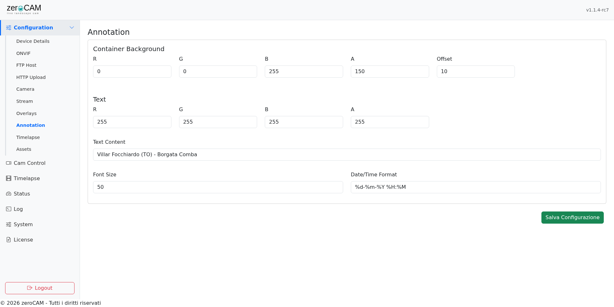
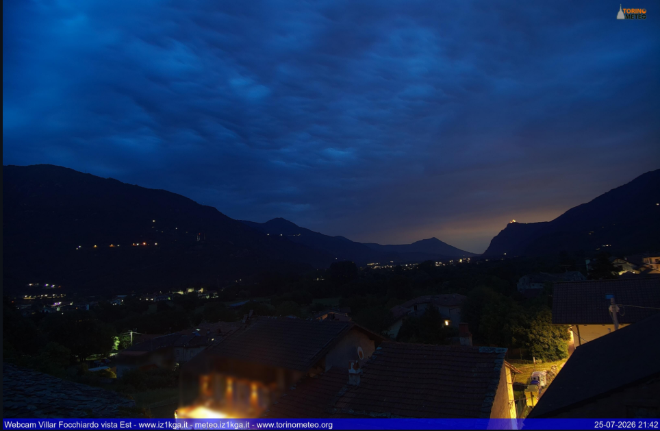
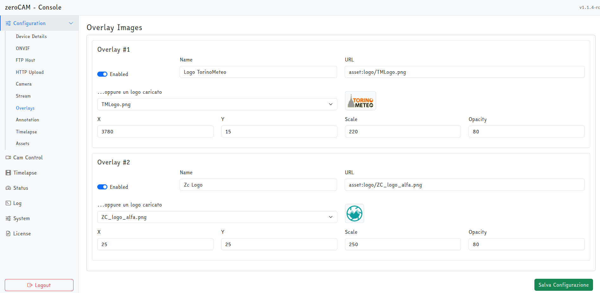
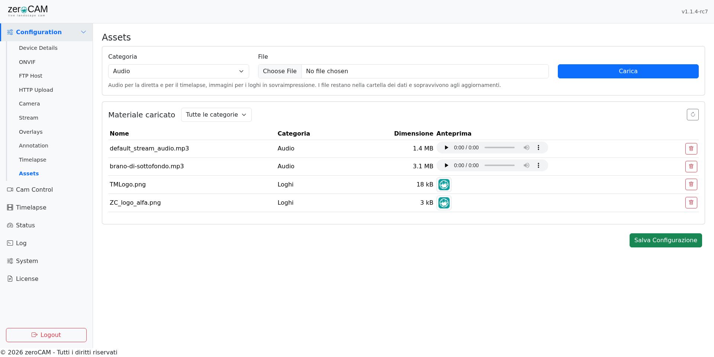

# Annotazione, loghi e assets

## L'anteprima

Le pagine **Annotation** e **Overlays** mostrano in cima l'ultimo scatto con la barra e i loghi disegnati sopra, aggiornati mentre si cambiano i valori. Serve a non dover salvare e aspettare lo scatto successivo per capire dove va a finire un logo.

**I loghi si trascinano.** Prendendone uno con il mouse, i campi *X* e *Y* si aggiornano da soli: è il modo naturale di posizionarli, e funziona come l'editor delle maschere privacy. Vale in entrambe le pagine, perché l'anteprima è la stessa; la nota che lo ricorda compare solo quando c'è almeno un logo attivo da trascinare.

Niente di quello che si vede nell'anteprima è salvato finché non si preme **Save Configuration**: chiudendo la pagina le prove fatte si perdono, e lo scatto successivo esce con i valori vecchi.

L'anteprima è disegnata dal browser, non dal dispositivo, quindi è immediata e non lo carica di lavoro. Il carattere è lo stesso file che il dispositivo usa per stampare l'annotazione, quindi il testo ha le proporzioni giuste; restano possibili scarti di qualche pixel nella posizione verticale del testo e nella lunghezza dei nomi di giorni e mesi, che nell'anteprima seguono la lingua del browser e nello scatto quella del dispositivo. La verifica definitiva resta la foto.

L'immagine di fondo è l'ultimo scatto **senza** barra né loghi, che il dispositivo conserva in memoria volatile a ogni cattura. Dopo un riavvio, e finché non arriva il primo scatto, l'anteprima non c'è e la pagina lo dice: da **Cam Control** si può scattare subito con *Take Photo*.

## La barra di annotazione

**Configuration → Annotation** definisce la fascia che compare in fondo all'immagine, con un testo libero a sinistra e la data/ora a destra.

I comandi stanno a destra dell'anteprima, così l'effetto di ogni modifica è sotto gli occhi mentre la si fa.

| Campo | Significato |
|---|---|
| Background color | Colore e trasparenza della fascia |
| Text Color | Colore e trasparenza del testo |
| Font Size | Altezza del carattere in pixel |
| Margin | Distanza fra testo e bordi; determina anche l'altezza della fascia |
| Text | Testo fisso, tipicamente nome della località e indirizzo del sito |
| Date and Time format | Formato della data, con i codici `strftime` |

I due colori si scelgono con il selettore del sistema, e la trasparenza con il cursore accanto: da 0, che rende l'elemento invisibile, a 255, che lo rende pieno. Sotto a ciascuno è scritto il valore risultante in forma `rgba(...)`, utile per riprodurre lo stesso colore altrove. Nel file di configurazione restano quattro numeri da 0 a 255 — `R`, `G`, `B`, `A` — che è la forma in cui il dispositivo li usa.

{ width=100% }

L'altezza della fascia è calcolata come corpo del carattere più due volte l'offset: per una barra più alta si aumenta l'offset, per un testo più grande il corpo.

Formati di data più comuni:

| Formato | Risultato |
|---|---|
| `%d-%m-%Y %H:%M` | `26-07-2026 19:21` |
| `%d/%m/%Y %H:%M:%S` | `26/07/2026 19:21:04` |
| `%A %d %B %Y` | nome del giorno e del mese, secondo la lingua di sistema |

Il carattere usato è `static/css/fonts/Arial.ttf`, incluso nell'applicazione.

{ width=100% }

## I loghi

**Configuration → Overlays** ha la stessa impostazione della pagina precedente: anteprima a sinistra, elenco dei loghi a destra. Passando con il mouse su una voce dell'elenco, il logo corrispondente si evidenzia sull'anteprima — con più loghi sovrapposti è l'unico modo per sapere quale si sta modificando.

L'elenco parte vuoto. **Add** inserisce un logo, e lo si può premere quante volte serve; il cestino accanto a ciascuno lo toglie. Non c'è un numero massimo, ma ogni logo attivo viene scaricato e sovrapposto a ogni scatto, quindi il tempo di elaborazione cresce con la quantità.

Un logo appena aggiunto non ha ancora un indirizzo: finché non lo si sceglie viene semplicemente saltato, senza comparire nel log come errore. Aggiunte e rimozioni valgono solo dopo **Save Configuration**: chiudendo la pagina prima, si perdono.

Ogni immagine ha:

| Campo | Significato |
|---|---|
| Enabled | Attiva o disattiva il singolo logo |
| Name | Etichetta, compare solo nel log |
| URL | Indirizzo dell'immagine, tipicamente un PNG con trasparenza |
| X, Y | Posizione dell'angolo superiore sinistro, in pixel dell'immagine finale |
| Scale | Percentuale di ridimensionamento |
| Opacity | Opacità in percentuale |

{ width=100% }

L'indirizzo può essere un URL http, come è sempre stato, oppure un file caricato in **Configuration → Assets**: in quel caso, invece di scriverlo a mano, si sceglie dal menu a tendina sopra il campo URL, che lo compila con un riferimento del tipo `asset:logo/nome.png` e mostra l'anteprima. Un logo caricato è preferibile a uno remoto: non dipende da un sito che può cambiare o sparire, e funziona anche con la webcam senza accesso a internet in uscita.

I loghi vengono scaricati e tenuti in memoria, e riscaricati a ogni salvataggio della configurazione: sostituendo un file all'origine, o fra gli assets, basta salvare per farlo riprendere: non serve riavviare.

Due comportamenti da conoscere:

* **La scala riduce soltanto.** Un valore superiore a 100 lascia il logo alle sue dimensioni originali: per averlo più grande serve un file sorgente più grande. Vale sia per la foto sia per il video, così le due uscite restano identiche.
* **L'opacità moltiplica la trasparenza del PNG.** Con `opacity: 80` un logo già semitrasparente diventa più tenue; con 100 resta come nel file.

Le coordinate si riferiscono all'immagine finale, cioè dopo il ritaglio. Cambiando le impostazioni di *Crop* i loghi vanno riposizionati.

## Annotazione e loghi sulla diretta

La spunta **Annotazione e loghi nella diretta**, in **Configuration → Stream**, riporta gli stessi elementi sul video trasmesso. Non c'è una seconda configurazione: testo, colori, corpo del carattere, coordinate e scala sono quelli della foto, riscalati per il rapporto fra la larghezza dello streaming e quella dello scatto. Un corpo di 50 pixel su una foto da 4056 diventa circa 31 pixel su uno streaming da 2560.

Il disegno lo fa ffmpeg mentre già ricodifica il video, con i filtri `drawbox`, `drawtext` e `overlay`: il costo in CPU è trascurabile e i fotogrammi non passano da Python. L'orologio è aggiornato fotogramma per fotogramma, quindi in diretta scorre davvero invece di restare fermo all'ora di avvio dello streaming.

Poiché il comando di ffmpeg si costruisce all'avvio dello streaming, l'attivazione ha effetto **al riavvio dello stream**, cioè dopo lo scatto successivo.

> **Requisito** — il filtro `drawtext` richiede un ffmpeg compilato con libfreetype. Sui pacchetti di Raspberry Pi OS c'è; per verificarlo: `ffmpeg -filters | grep drawtext`.

Un'ultima differenza da tenere presente: se lo streaming inquadra una porzione di sensore diversa da quella della foto, la posizione dei loghi può risultare spostata di qualche pixel rispetto allo scatto. Le coordinate vengono riscalate, non riproiettate come accade invece per le maschere privacy.

## Gli assets

**Configuration → Assets** è il magazzino del materiale che l'utente carica: i **loghi** da sovrapporre e i **brani audio** per la diretta e per il timelapse. I file finiscono nella cartella dei dati, in `data/assets/<categoria>/`, quindi un aggiornamento del software non se li porta via.

Il caricamento chiede la categoria e il file. Sono ammessi:

| Categoria | Estensioni |
|---|---|
| Audio | `.mp3`, `.aac`, `.m4a`, `.ogg`, `.opus`, `.wav`, `.flac` |
| Logos | `.png`, `.jpg`, `.jpeg`, `.gif`, `.webp`, `.bmp` |

Il limite per file è di 32 MB. Il nome viene ripulito da accenti, spazi e caratteri speciali, perché finisce in una riga di comando di ffmpeg: *Brano Estivo (2026).mp3* diventa `Brano-Estivo-2026-.mp3`.

L'elenco mostra dimensione e anteprima — un lettore per l'audio, la miniatura per le immagini — e permette di eliminare. Il filtro in alto restringe a una sola categoria.

{ width=100% }

Nelle altre pagine gli assets non si scrivono a mano: compaiono nelle tendine *Background audio* (Stream), *Background track* (Timelapse) e nella tendina dei loghi (Overlays). In configurazione vengono salvati come `asset:categoria/nome`, un riferimento indipendente dal percorso di installazione: un backup della configurazione ripristinato su un altro Raspberry continua a puntare al file giusto, **purché quel file sia stato ricaricato**. Il backup della configurazione contiene le impostazioni, non i file degli assets: quelli vanno copiati a parte, o ricaricati dall'interfaccia.

Eliminando un asset ancora referenziato non succede nulla di drammatico: il riferimento resta in configurazione ma punta al vuoto, e chi lo usa lo segnala nel log e prosegue — la diretta va in onda muta, il timelapse viene montato senza audio, il logo viene saltato.

zeroCAM porta con sé un brano di esempio, `default_stream_audio.mp3`, che viene installato fra gli assets al primo avvio. Se lo si cancella non torna: la copia avviene solo per i file mancanti che l'applicazione non ha ancora installato.
