# Streaming in diretta

## Come funziona

Il Raspberry Pi produce fotogrammi grezzi che ffmpeg codifica in H.264 e spinge via RTMP verso YouTube — e, se richiesto, verso altre destinazioni. All'audio provvede una traccia silenziosa generata da ffmpeg, necessaria perché YouTube accetti il flusso, oppure un brano scelto dall'utente.

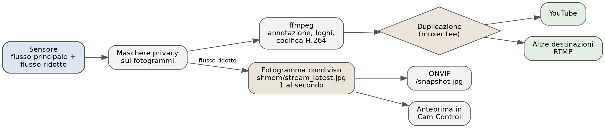{ width=100% }

Lo streaming si ferma a ogni scatto e riparte subito dopo: la camera non può servire contemporaneamente la cattura a piena risoluzione e il video. Sono pochi secondi, e la diretta è configurata per sopravvivere all'interruzione senza chiudersi.

## Parametri dello streaming

**Configuration → Stream**

| Campo | Significato |
|---|---|
| Streaming Enabled | Attiva la trasmissione |
| YouTube Stream Key | Chiave di streaming presa da YouTube Studio; cifrata in configurazione |
| Resolution | Larghezza e altezza del video, per esempio 2560×1440 |
| Destinazioni aggiuntive | Altri URL RTMP verso cui ritrasmettere |
| Annotazione e loghi nella diretta | Disegna barra, orologio e loghi sul video |
| Audio di sottofondo | Brano ripetuto in loop al posto del silenzio |
| Volume | Attenuazione del brano, in percentuale |

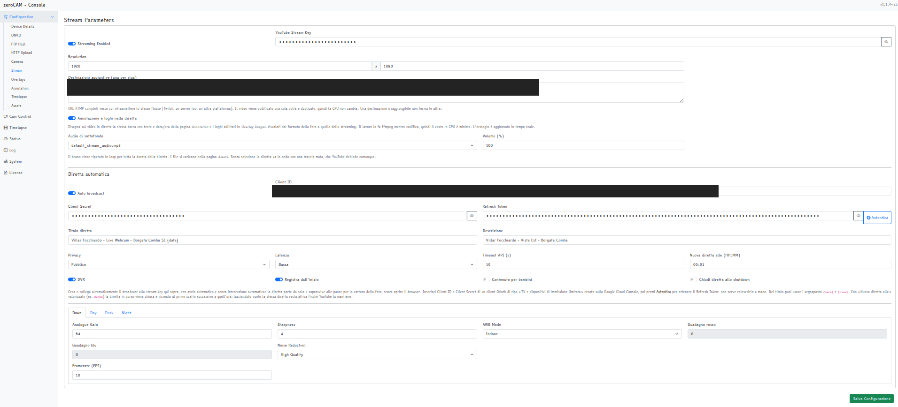{ width=100% }

Nelle schede per fase del giorno si impostano frequenza dei fotogrammi (`framerate`), guadagno, bilanciamento del bianco, riduzione del rumore e nitidezza: di notte conviene un framerate basso (4–5) e un guadagno alto, di giorno il contrario.

Il bilanciamento del bianco funziona come per lo scatto, modalità *Manuale* compresa: sotto le luci al sodio è il modo per evitare che la diretta viri all'arancione. Vedi il capitolo *La cattura delle immagini*.

Bitrate e buffer (`bitrate`, `buffer`) governano la qualità: 4000–4500 kbit/s per il 1440p sono un punto di partenza sensato. La codifica usa il preset `veryfast` e un gruppo di immagini pari a due secondi, come richiesto dalle piattaforme di live.

## L'audio della diretta

Di suo lo streaming è muto: la traccia esiste solo perché senza audio il flusso viene rifiutato. Con *Audio di sottofondo* si sceglie invece un brano fra quelli caricati in **Configuration → Assets**, che viene ripetuto in loop per tutta la durata della diretta. Il *Volume* lo attenua: 20–30% è di norma sufficiente per una musica di sottofondo che non copra tutto.

Il brano viene letto a velocità reale e ricodificato in AAC dallo stesso ffmpeg che sta già comprimendo il video: il costo aggiuntivo in CPU è irrilevante. Come per l'overlay, il comando si costruisce all'avvio dello streaming, quindi il cambio ha effetto **dopo lo scatto successivo**.

Attenzione ai diritti: una diretta con musica protetta può essere rivendicata da Content ID, silenziata o bloccata in alcuni paesi, e su una webcam attiva ventiquattr'ore su ventiquattro la rivendicazione arriva prima o poi. Vanno usati brani propri o con licenza che ne consenta l'uso.

## Ritrasmissione su più destinazioni

Nel campo *Destinazioni aggiuntive* si elencano altri URL RTMP completi, uno per riga: Twitch, un server proprio, un'altra piattaforma. Il video viene codificato **una sola volta** e semplicemente duplicato verso tutte le uscite, quindi il carico sulla CPU non cambia con il numero di destinazioni.

Una destinazione irraggiungibile non trascina giù le altre: viene ignorata per quella sessione di streaming.

## La diretta automatica su YouTube

La sola chiave di streaming non manda in onda nulla: YouTube ha ritirato lo "Stream now", e senza un *broadcast* collegato i dati arrivano ma restano invisibili finché qualcuno non apre la Live Control Room. zeroCAM crea e collega il broadcast da sé, via YouTube Data API.

### Credenziali

Le credenziali si creano una volta sola, e servono sia alla diretta sia al caricamento del timelapse. La procedura si fa tutta dal browser di un PC o di un telefono: sul Raspberry non serve nulla.

Prima di cominciare, il canale YouTube deve avere le **dirette abilitate**. Si controlla su [youtube.com/features](https://www.youtube.com/features): richiede la verifica del numero di telefono e la prima attivazione può richiedere fino a 24 ore. Senza, tutto il resto funziona ma il primo tentativo di andare in onda fallisce.

#### 1. Creare il progetto

Sulla [Google Cloud Console](https://console.cloud.google.com/), dal selettore in alto, **Nuovo progetto**. Il nome è solo per te: serve a tenere separata questa webcam dal resto delle cose che hai su Google.

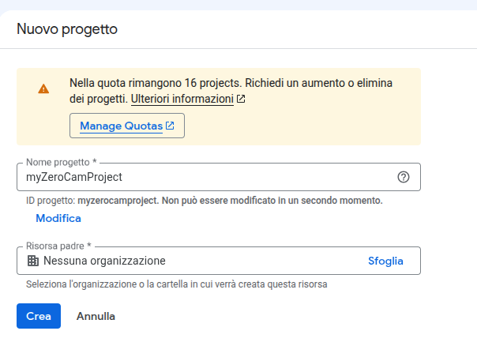{ width=75% }

#### 2. Abilitare l'API

Con il nuovo progetto selezionato, andare in **API e servizi → Libreria**, cercare **YouTube Data API v3** e premere *Abilita*. È l'unica API che serve.

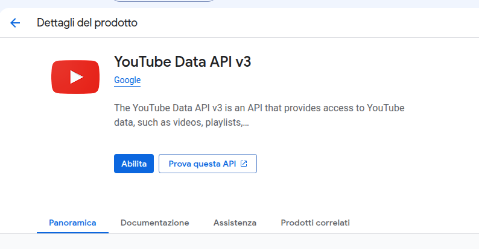{ width=80% }

#### 3. Configurare la schermata di consenso

In **Google Auth Platform → Panoramica** parte una procedura in quattro passi. Il nome dell'applicazione comparirà nella schermata di autorizzazione: può essere qualsiasi cosa.

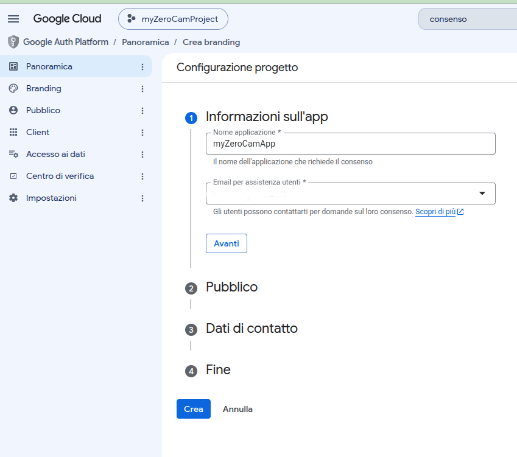{ width=85% }

Come tipo di utente scegliere **Esterno**. *Interno* è disponibile solo con un account Google Workspace e non serve qui.

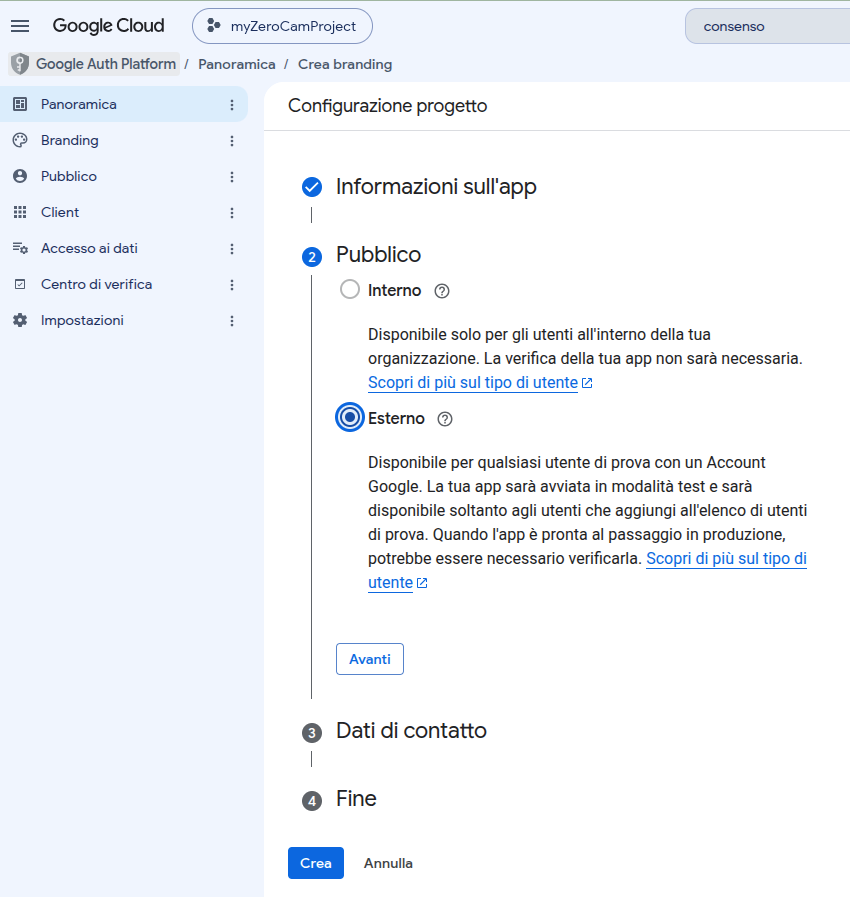{ width=85% }

Seguono l'indirizzo email per le comunicazioni di Google e l'accettazione delle condizioni.

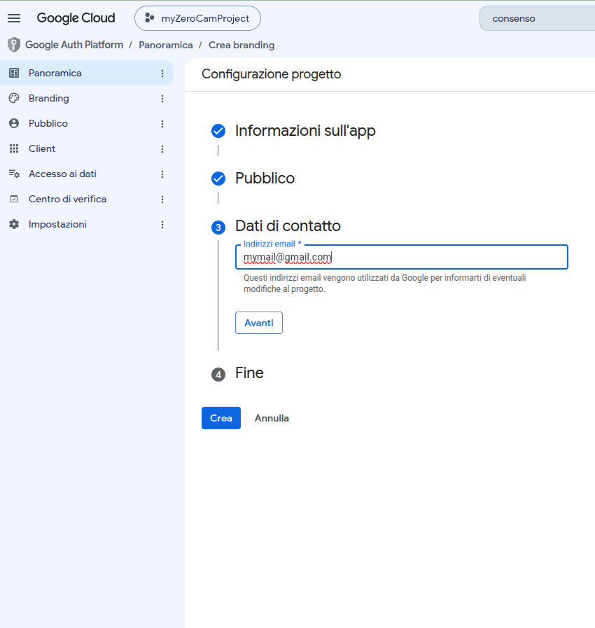{ width=85% }

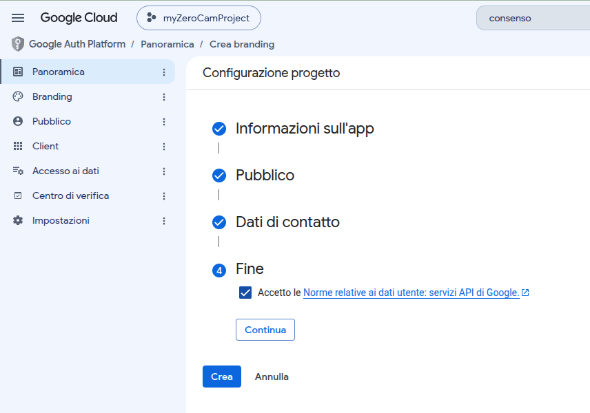{ width=85% }

#### 4. Pubblicare l'app

Finita la procedura, l'app resta in stato **Test**. Va portata in produzione: nella pagina **Pubblico**, premere *Pubblica app*.

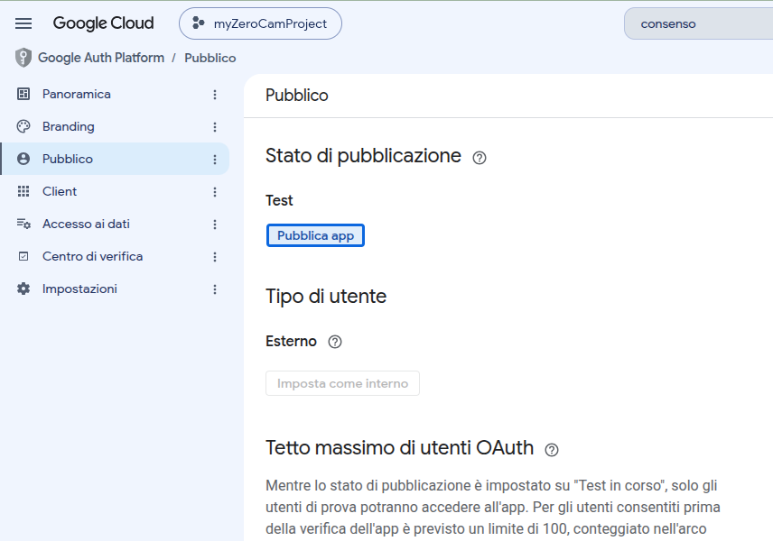{ width=85% }

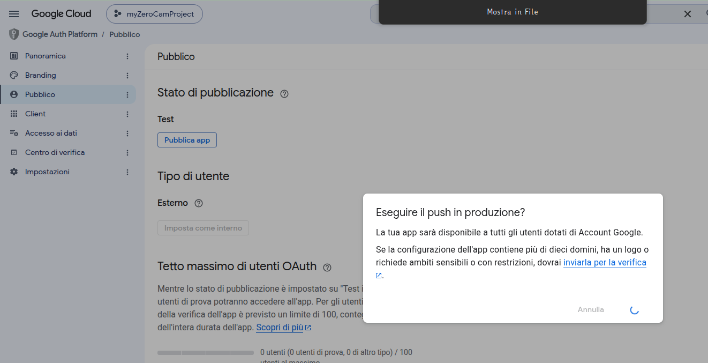{ width=90% }

Questo passaggio è quello che si dimentica più spesso, e l'effetto arriva in ritardo: finché lo stato è *Test*, Google revoca i refresh token dopo **sette giorni**, e la diretta smette di ripartire una settimana dopo un'installazione che sembrava perfetta. L'app non ha bisogno di essere verificata da Google: la verifica serve a distribuirla ad altri, e la sua assenza si nota solo nell'avviso "app non verificata" durante l'autorizzazione, da superare con *Avanzate → Vai a...*.

#### 5. Creare il client OAuth

In **Client → Crea client**, come tipo di applicazione scegliere **TV e dispositivi di immissione limitata**.

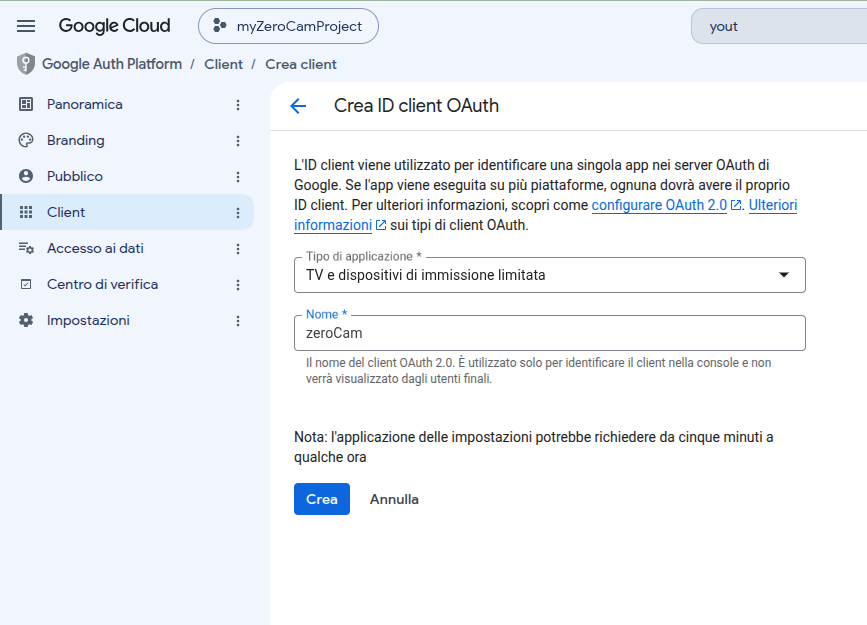{ width=85% }

Il tipo conta davvero: zeroCAM usa il *device flow*, quello dei televisori, ed è l'unico che funziona su un dispositivo senza browser raggiunto via LAN. Con un client di tipo *Applicazione desktop* o *Applicazione web* il pulsante *Autentica* risponde «Credenziali non valide o client OAuth del tipo sbagliato».

Alla conferma compaiono **ID client** e **Client secret**. Vanno copiati subito: il secret non è più visualizzabile dopo aver chiuso la finestra, e in tal caso va creato un altro client.

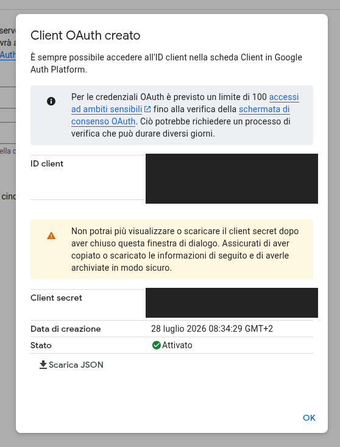{ width=65% }

#### 6. Autenticare la webcam

In **Configuration → Stream → Diretta automatica** incollare i due valori e premere **Autentica**.

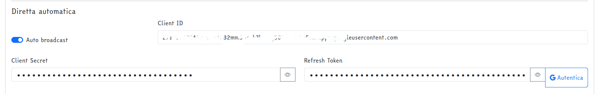{ width=100% }

Compare un codice di otto caratteri e l'indirizzo [google.com/device](https://www.google.com/device), da aprire su qualsiasi dispositivo: il telefono va benissimo. Inserito il codice, Google chiede di accedere e di **scegliere il canale** su cui pubblicare — per un account Brand è qui, e solo qui, che si seleziona quello giusto.

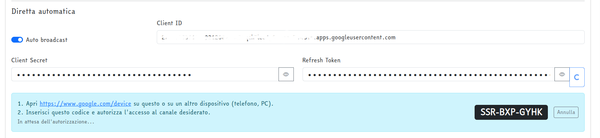{ width=100% }

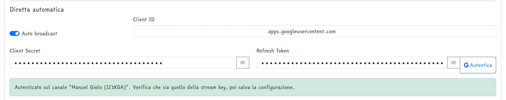{ width=100% }

Concessa l'autorizzazione, il **Refresh Token** viene compilato da solo e l'interfaccia dichiara su quale canale ci si è autenticati. Deve essere quello da cui proviene la chiave di streaming: se non lo è, il primo scatto fallisce con `The user is not enabled for live streaming`. A quel punto restano da attivare *Auto broadcast* e **salvare** la configurazione.

Il pulsante funziona anche raggiungendo la webcam in http sulla LAN, senza HTTPS né redirect. Da un PC con browser resta comunque disponibile `installation_tools/yt_oauth_setup.py`, che però richiede un client OAuth di tipo *Applicazione desktop*.

Cambiando progetto sulla Cloud Console il refresh token va rigenerato, perché è legato al client ID. La chiave di streaming invece non cambia: appartiene al canale YouTube, non al progetto.

### Impostazioni del broadcast

| Campo | Significato |
|---|---|
| Titolo diretta | Accetta i segnaposto `{date}` e `{time}` |
| Descrizione | Testo della diretta |
| Privacy | Pubblico, non in elenco o privato |
| Latenza | Normale, bassa o molto bassa |
| Timeout API | Attesa massima per le chiamate a YouTube |
| DVR, Registra dall'inizio | Opzioni di registrazione della diretta |
| Contenuto per bambini | Dichiarazione richiesta da YouTube |
| Chiudi diretta allo shutdown | Termina il broadcast quando l'applicazione si arresta |
| Nuova diretta alle (HH:MM) | Ricambio giornaliero del broadcast |

Il broadcast viene creato con avvio automatico e senza interruzione automatica: va in onda da solo appena ffmpeg comincia a pubblicare e sopravvive alle pause per la cattura. Il monitor stream è disattivato, altrimenti l'avvio automatico porterebbe la diretta in "testing" invece che in onda.

### Riuso e ricambio

Prima di ogni ripartenza dello streaming il software cerca un broadcast già collegato alla stream key e in stato `active` o `upcoming`, e lo riusa. Ne crea uno nuovo solo quando non ne trova, cosa che accade tipicamente quando YouTube chiude la diretta al limite delle 12 ore.

Il campo **Nuova diretta alle (HH:MM)** forza invece un ricambio quotidiano: al primo scatto successivo a quell'ora la diretta in corso viene chiusa e ne parte una nuova, con il titolo rivalutato dai segnaposto. Impostandolo a `00:00` si ottiene una diretta al giorno, con la data corretta nel titolo. Lasciando il campo vuoto il comportamento resta quello precedente: il campo è vuoto anche nelle installazioni nuove, quindi il ricambio va abilitato esplicitamente.

Ogni volta che una diretta viene riusata il log dice perché non è stata sostituita, così è immediato capire se il ricambio è attivo:

```
Reusing YouTube broadcast Xy1z2 (daily reset not configured).
Reusing YouTube broadcast Xy1z2 (started after the daily reset of 27/07/2026 00:00).
```

## Anteprima nell'interfaccia

Mentre lo streaming è attivo, in **Cam Control** compare l'interruttore **Anteprima diretta**: mostra un fotogramma al secondo preso dal flusso video al posto dell'ultimo scatto. È lo stesso fotogramma che alimenta ONVIF, con le maschere privacy già applicate, scritto su tmpfs per non consumare la microSD.

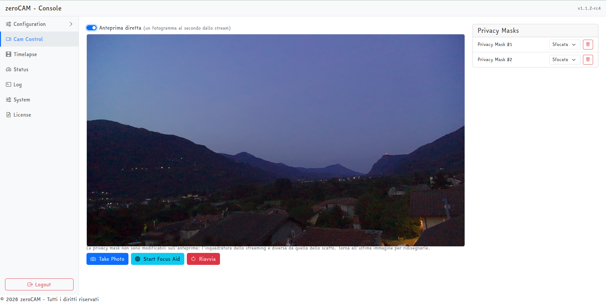{ width=100% }

L'interruttore compare solo se il fotogramma è recente: nei secondi in cui lo streaming è fermo per lo scatto l'anteprima torna da sola all'ultima immagine.

## Verifiche e diagnosi

All'avvio dello streaming il log riporta destinazioni, maschere preparate e, se attivo, l'overlay:

```
Restreaming to 2 destinations: a.rtmp.youtube.com, live.twitch.tv
Frame privacy masks ready for 2560x1440: 2 blurred, 1 filled.
Stream overlay 'Logo' at 2171,6 scaled to 227px wide.
Reusing YouTube broadcast xxxxxxxx.
```

Se ffmpeg si chiude in modo anomalo compare `Broken pipe with ffmpeg, stopping stream.`: lo streaming riparte al ciclo successivo. Se il messaggio si ripete a ogni ciclo, la causa è quasi sempre nella riga di comando di ffmpeg — chiave di streaming errata, destinazione aggiuntiva malformata o filtro non disponibile nel build di ffmpeg installato.
