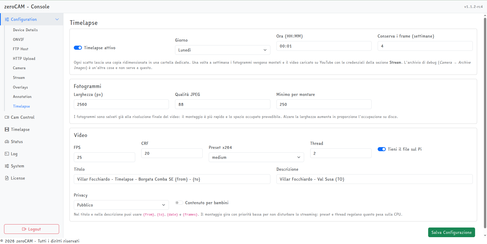
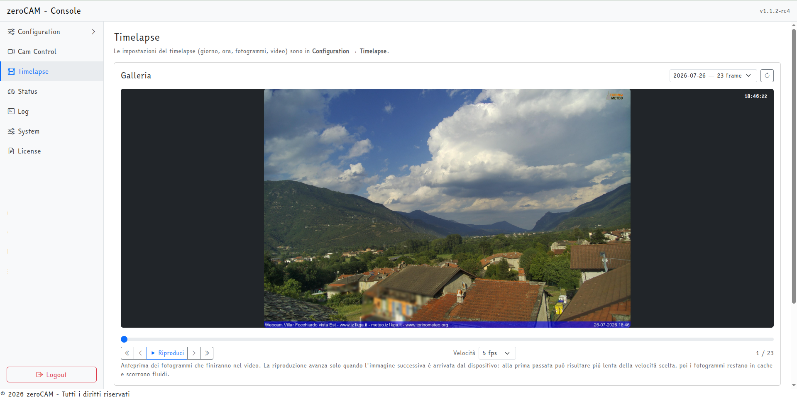

# Timelapse settimanale

## Il principio

Ogni scatto lascia una copia ridimensionata in `data/timelapse_frames/`. Una volta a settimana i fotogrammi vengono montati con ffmpeg e il video caricato sul canale YouTube. L'archivio di debug (*Camera → Archive Images*) è un'altra cosa e non partecipa.

I fotogrammi sono salvati già alla risoluzione finale del video: il montaggio è più rapido e lo spazio occupato è prevedibile. Il fotogramma è l'immagine definitiva — ritagliata, mascherata e annotata — quindi il video mostra esattamente ciò che è stato pubblicato.

## Configurazione

**Configuration → Timelapse**

| Campo | Significato |
|---|---|
| Timelapse attivo | Attiva raccolta, montaggio e pubblicazione |
| Giorno, Ora | Quando eseguire il montaggio settimanale |
| Conserva i frame (settimane) | Età oltre la quale i fotogrammi vengono cancellati |
| Larghezza (px) | Larghezza dei fotogrammi, e quindi del video |
| Qualità JPEG | Qualità di compressione dei fotogrammi |
| Minimo per montare | Sotto questo numero di fotogrammi il montaggio non parte |
| FPS | Fotogrammi al secondo del video finale |
| CRF | Qualità della codifica: più basso, più qualità e più peso |
| Preset x264 | Compromesso fra velocità e compressione |
| Thread | Core impiegati dalla codifica |
| Tieni il file sul Pi | Conserva il video montato in `data/timelapse/` |
| Titolo, Descrizione | Testi del video, con segnaposto |
| Privacy, Contenuto per bambini | Impostazioni di pubblicazione su YouTube |

{ width=100% }

Nei testi si possono usare `{from}`, `{to}`, `{date}` e `{frames}`, sostituiti rispettivamente con la data del primo e dell'ultimo fotogramma, la data del montaggio e il numero di fotogrammi.

Il montaggio gira con priorità bassa (`nice 19`) per non disturbare lo streaming: preset e numero di thread regolano quanto pesa sulla CPU. Su un Pi 5, `medium` con 2 thread è un buon compromesso.

## Pianificazione

Il montaggio parte nel giorno e all'ora impostati. Indipendentemente da esso, ogni giorno alle 04:30 gira una pulizia che elimina i fotogrammi più vecchi della finestra di conservazione: se il montaggio fallisce per settimane, i fotogrammi non si accumulano senza limite.

Cambiare giorno e ora richiede il riavvio dell'applicazione, perché la pianificazione viene costruita all'avvio.

## Spazio su disco

È l'aspetto che sorprende di più. Con uno scatto ogni 10 minuti a 2560 pixel di larghezza si producono circa 144 fotogrammi al giorno, dell'ordine del gigabyte al mese. Con quattro settimane di conservazione l'occupazione si stabilizza intorno al gigabyte.

Per ridurla si può abbassare la larghezza dei fotogrammi, la qualità JPEG, o accorciare la finestra di conservazione. La pagina **Timelapse** mostra sempre quanti fotogrammi ci sono e quanto occupano.

## Montaggio a comando

I pulsanti in fondo alla pagina Timelapse:

* **Genera e pubblica ora** — monta e carica subito, senza attendere la scadenza settimanale;
* **Genera senza pubblicare** — monta soltanto, utile per controllare il risultato prima di renderlo pubblico;
* **Aggiorna** — rilegge lo stato.

Il montaggio dura diversi minuti e prosegue in background: l'esito compare nel riquadro *Stato*, con il numero di fotogrammi usati e il collegamento al video su YouTube.

## Galleria

Nella stessa pagina una galleria permette di scorrere i fotogrammi raccolti: si sceglie il giorno, si scorre con il cursore o con le frecce, e il pulsante *Riproduci* fa un'anteprima animata a 2, 5 o 10 fotogrammi al secondo.

{ width=100% }

La riproduzione avanza solo quando l'immagine successiva è arrivata dal dispositivo: alla prima passata può risultare più lenta della velocità scelta, poi i fotogrammi restano nella cache del browser e scorrono fluidi. È il modo più rapido per accorgersi di una giornata di fotogrammi rovinati prima di montare il video.

## Caricamento su YouTube

Il video viene caricato con le stesse credenziali OAuth della diretta, in modalità *resumable* a blocchi da 8 MiB: un'interruzione di rete non costringe a ricominciare da capo. Serve l'ambito `youtube.upload`, che un refresh token generato prima dell'introduzione di questa funzione non ha: in tal caso va rigenerato con `yt_oauth_setup.py`.

Se *Tieni il file sul Pi* è disattivo, il video viene rimosso dopo il caricamento riuscito.
