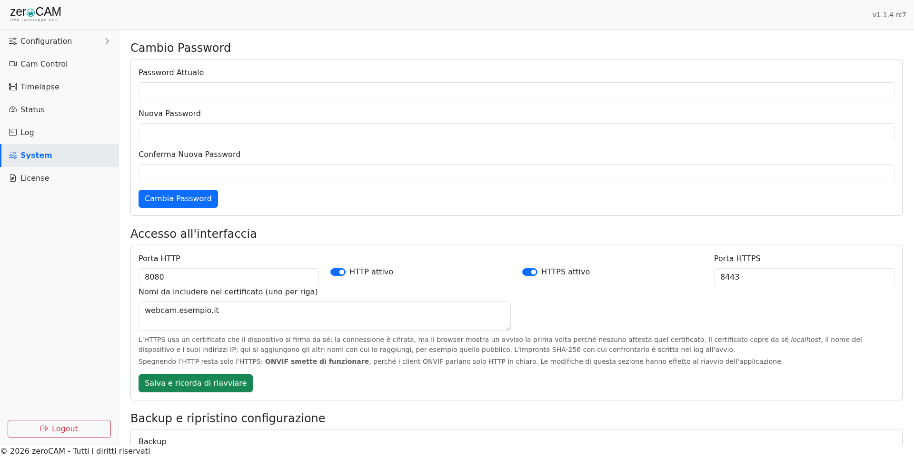
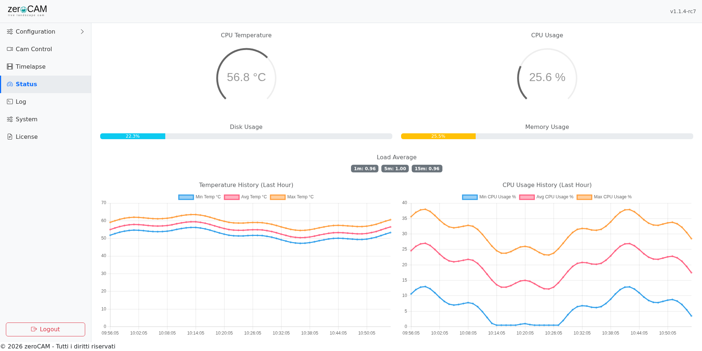

# Manutenzione

## Backup e ripristino della configurazione

Dalla pagina **System** si scarica l'intera configurazione — privacy mask comprese — in un unico file JSON, e la si reimporta in caso di microSD morta o reinstallazione.

Sul dispositivo i segreti sono cifrati con `ZEROCAM_SECRET_KEY`, che vive nell'ambiente del servizio: copiare `.conf.json` così com'è darebbe un backup illeggibile su un'installazione nuova. Il backup viene quindi costruito dalla configurazione decifrata e richiuso subito con una **passphrase scelta al momento del download** (PBKDF2-SHA256 e Fernet, con sale casuale). Il file non contiene nulla in chiaro ed è ripristinabile su qualunque dispositivo, anche con una chiave segreta diversa.

{ width=100% }

> **La passphrase non è recuperabile.** Se si perde, il backup è inutilizzabile. Va conservata separatamente dal file.

Il ripristino chiede file e passphrase, riscrive la configurazione ricifrando i segreti con la chiave locale e sovrascrive le maschere privacy. Restano fuori la password di accesso all'interfaccia e la chiave di sessione, che rimangono quelle del dispositivo su cui si ripristina: un backup vecchio non rimette mai in uso credenziali di login superate. Dopo il ripristino conviene riavviare.

Un backup va scaricato almeno: dopo la prima configurazione completa, dopo ogni modifica importante, e prima di un aggiornamento.

## Log

La pagina **Log** mostra il file corrente, aggiornato ogni due secondi. Su disco:

```
/usr/local/zerocam/data/logs/zerocam.log
```

La rotazione è giornaliera e conserva sette giorni. Il livello di dettaglio si governa con `LOG_LEVEL` nel file `.env` (`DEBUG` per le indagini, `INFO` in esercizio). In alternativa, il log del servizio:

```bash
journalctl -u zerocam.service -f
```

Righe da conoscere:

| Messaggio | Significato |
|---|---|
| `[12s] Tentativo 3/40: ...` | Bracketing in corso: fra parentesi il tempo dall'inizio della cattura |
| `Esposizione ottimale trovata in 58.7s con 4 tentativi.` | Ricerca conclusa con successo |
| `Capture job finished in 71.2s.` | Ciclo di scatto concluso, con la sua durata |
| `Nessuna esposizione perfetta trovata` | Il bracketing si è fermato sul risultato più vicino |
| `Broken pipe with ffmpeg` | Lo streaming si è interrotto; riparte al ciclo successivo |
| `No YouTube liveStream matches the configured stream key` | Chiave di streaming errata o non presente nell'account |
| `Timelapse retention: removed N frames` | Pulizia dei fotogrammi vecchi |
| `Moved ... to the data directory` | Migrazione dei dati dopo un aggiornamento |

## Statistiche hardware

La pagina **Status** mostra temperatura e uso della CPU con indicatori e grafici. I dati vengono letti ogni secondo, aggregati (minimo, massimo, media) e conservati in `data/logs/stats.json`, che tiene gli ultimi 288 record: circa un giorno di storico. Il file sopravvive agli aggiornamenti.

{ width=100% }

Su un Pi 5 in cassetta esterna la temperatura è il valore da tenere d'occhio: sopra i 70 °C conviene rivedere ventilazione o esposizione al sole della custodia.

## Riavvio

Il pulsante **Riavvia** in Cam Control riavvia l'intero Raspberry Pi. Per riavviare la sola applicazione, più rapido:

```bash
sudo systemctl restart zerocam.service
```

Di norma **non serve**: salvando dalla pagina di configurazione le impostazioni vengono passate subito ai componenti già in funzione, e valgono dallo scatto successivo. Fanno eccezione poche cose, che si stabiliscono all'avvio del programma:

| Impostazione | Perché serve il riavvio |
|---|---|
| `onvif.enabled` | Le rotte del servizio ONVIF vengono registrate sul server web all'avvio |
| `settingsManager.port`, HTTP/HTTPS e certificato | Le porte vengono aperte all'avvio |
| `cameraParameters.type` | L'oggetto camera viene costruito una volta sola |
| Variabili d'ambiente (`.env`) | Lette dal processo all'avvio |
| Password dell'interfaccia | Si cambia dalla pagina System, che gestisce da sé la sessione |

Tutto il resto — intervallo di scatto, pianificazione del timelapse, parametri di ripresa, ritaglio, annotazione, loghi, destinazioni FTP e HTTP, credenziali YouTube, audio — entra in vigore senza riavviare. Le impostazioni che riguardano il video in diretta (risoluzione, destinazioni, overlay, audio, larghezza ONVIF) hanno effetto **alla ripartenza dello streaming**, cioè dopo lo scatto successivo, perché il comando di ffmpeg si costruisce in quel momento.

## Aggiornamento

Si rilancia lo script di installazione indicando il nuovo tag. Configurazione, chiavi, log, fotogrammi e immagini restano nella cartella dei dati, che non viene toccata; le chiavi di configurazione introdotte dalla nuova versione vengono aggiunte con i loro valori di default.

Dopo l'aggiornamento vale la pena controllare la pagina Log per i primi minuti e verificare che il primo scatto e la ripartenza dello streaming siano andati a buon fine.

## Spazio su disco

I consumatori di spazio, in ordine:

1. `data/timelapse_frames/` — governato dalla finestra di conservazione;
2. `data/images/` — l'archivio di diagnosi, di norma spento; se acceso cresce **senza pulizia automatica** e va svuotato a mano;
3. `data/timelapse/` — i video montati, se si sceglie di conservarli;
4. `data/assets/` — audio e loghi caricati; quanto pesa lo decide l'utente, un brano di qualche minuto è dell'ordine dei megabyte;
5. `data/logs/` — trascurabile, con rotazione a sette giorni.

```bash
du -sh /usr/local/zerocam/data/*
```

## Salvataggio di un'installazione

Il certificato TLS sta in `data/certs/` e non va incluso da nessuna parte: se manca viene rigenerato al primo avvio. Cambia l'impronta, quindi il browser chiederà di accettarlo di nuovo.

Per replicare o recuperare una webcam servono quattro cose: il backup della configurazione dalla pagina System con la sua passphrase, il contenuto di `data/assets/` (loghi e audio, che il backup **non** include perché contiene solo impostazioni), l'eventuale archivio dei fotogrammi se si vuole conservare lo storico del timelapse, e le credenziali OAuth di YouTube (che comunque il backup contiene). Il resto lo rifà l'installer.
